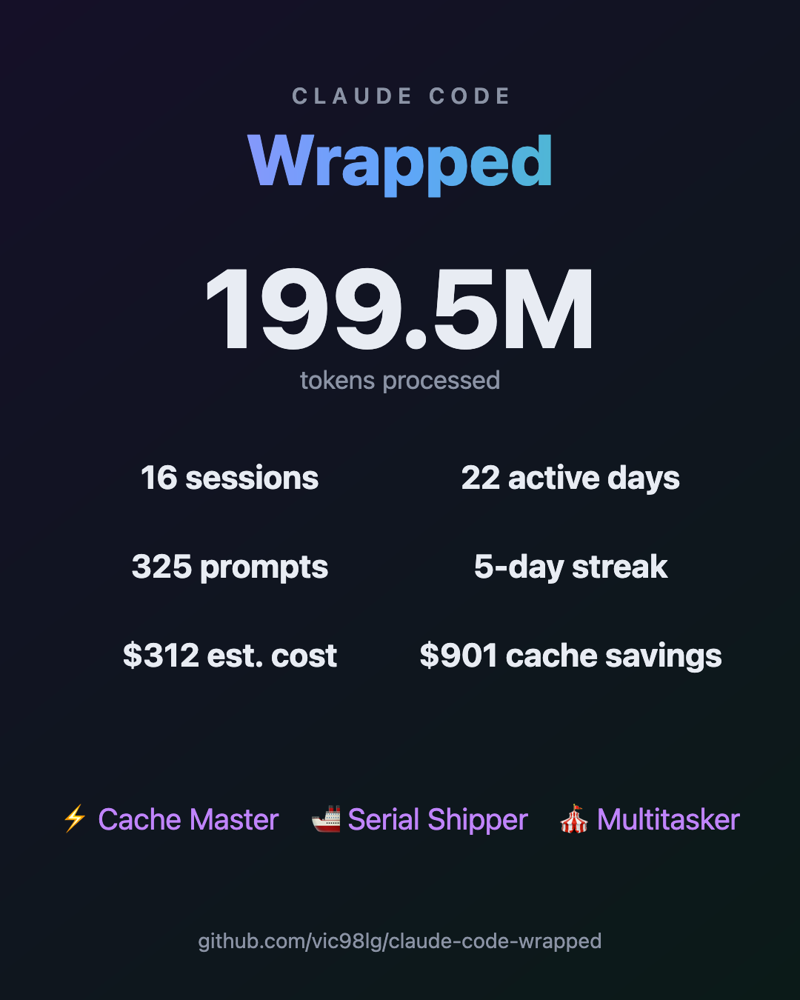

# 🎁 Claude Code Wrapped

> Your Claude Code usage, **Spotify-Wrapped style**. One command, zero dependencies, 100% local.

Ever wondered how many tokens you've burned with Claude Code? Which tools it hammers the most? How much money prompt caching quietly saved you? Whether you're a 🦉 Night Owl or a 🚢 Serial Shipper?

**Claude Code Wrapped** reads the transcripts Claude Code already stores on your machine (`~/.claude/projects`) and turns them into a gorgeous, animated, shareable report.



## ✨ What you get

- **Total tokens** — input, output, cache writes and cache reads, with an animated hero counter
- **💸 Estimated cost & cache savings** — see what caching actually saved you
- **🤖 Model breakdown** — Fable vs Opus vs Sonnet vs Haiku
- **🛠️ Favorite tools** — Bash? Edit? WebSearch? Ranked with charts
- **📁 Top projects** — where your tokens actually went
- **🔍 Most edited files & top shell commands** — the fingerprint of your workflow
- **🗓️ Activity heatmap** — 7×24 grid of when you really code
- **🔥 Streaks & session records** — longest streak, longest focused session
- **🏆 Badges** — Night Owl, Cache Master, Agent Orchestrator, Marathoner…
- **📸 Share card** — export a 1080×1350 PNG ready for social media

## 🚀 Quick start

```bash
npx claude-code-wrapped
```

That's it. Your report opens in the browser and a summary prints in the terminal.

No Claude Code data yet? Try the demo:

```bash
npx claude-code-wrapped --demo
```

## 🔒 Privacy

**Nothing ever leaves your machine.** No telemetry, no network calls, no analytics. The report is a single self-contained HTML file generated locally — read the source, it's one file.

## ⚙️ Options

| Flag | Description |
|------|-------------|
| `--demo` | Generate a report with sample data |
| `--since 2026-01-01` | Only include activity since a date |
| `--dir <path>` | Custom transcripts dir (default `~/.claude/projects`) |
| `--out <file>` | Output HTML path (default `./claude-wrapped.html`) |
| `--json` | Dump raw stats as JSON (pipe it anywhere) |
| `--no-open` | Don't auto-open the browser |

## 💰 A note on costs

Costs are **estimates** computed at Anthropic API list prices (cache writes at 1.25×, cache reads at 0.1× input price). If you're on a subscription plan your real cost differs — think of it as *"what this usage would cost on the API"*, which is exactly what makes the cache-savings number fun.

Prices live in a single table at the top of [`bin/claude-wrapped.js`](bin/claude-wrapped.js) — tweak them if they drift.

## 🧠 How it works

Claude Code stores every session as JSONL under `~/.claude/projects/<project>/<session>.jsonl`. Each assistant message carries `usage` (tokens by type) and `model`; tool calls carry their name and input. This CLI streams every line, aggregates ~20 metrics, and renders them into a self-contained HTML report — no build step, no dependencies, works offline.

## 🤝 Contributing

Issues and PRs welcome. Good first ideas:

- More badges (streak tiers, language detection from file extensions)
- `--compare` between two time ranges
- Team mode: merge multiple exports into one report

## 📄 License

[MIT](LICENSE)
